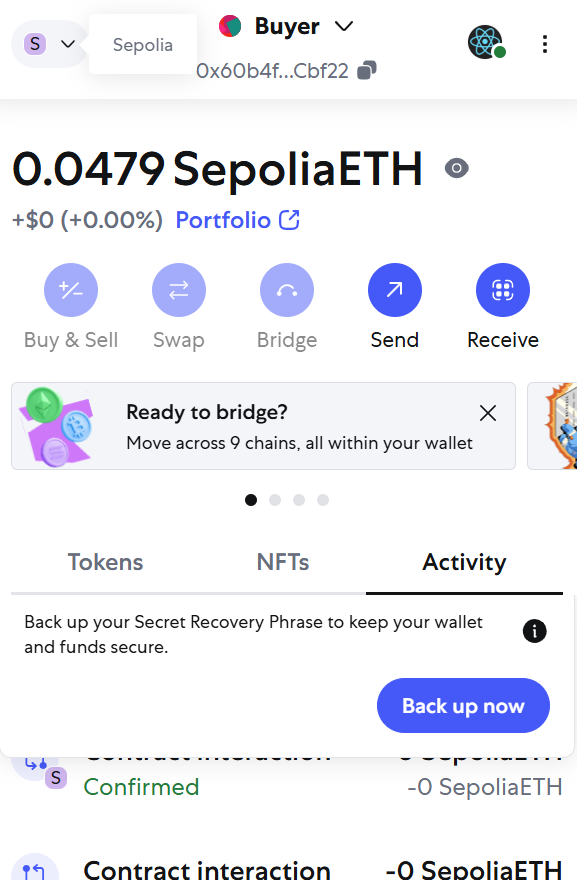
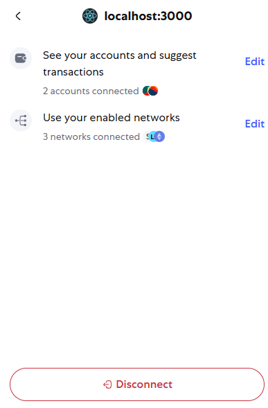

## Frontend + Smart Contract code
Frontend Folder: defi-payment-app

Smart Contract file: defi_code.sol

Contract tester results: test_results_ContractTester folder

## Website link
https://alwinchoi.github.io/COMP4541_Project/

## Instructions

Please create **two** accounts if you wish to test this on the same wallet and select the two accounts after pressing connect wallet

Make sure to select the Buyer account on the metaMask once everything is connected:

There is a chance if you only connect one account, you have to disconect the wallet from the website and press connect website again:

## Testnet used: 
Sepolia ETH testnet 

## Etherscan link
smart contract address: 0xB221D20D9ad90A904Ebaaf49b771b26E22EE7443

https://sepolia.etherscan.io/tx/0x80ea74bb8d06c72102504c4202ea077baf7f8a71ff4a23beda22998dc2b4b590

https://sepolia.etherscan.io/address/0xb221d20d9ad90a904ebaaf49b771b26e22ee7443

